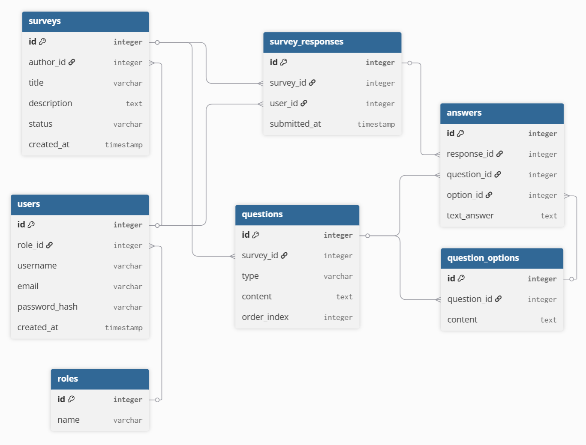
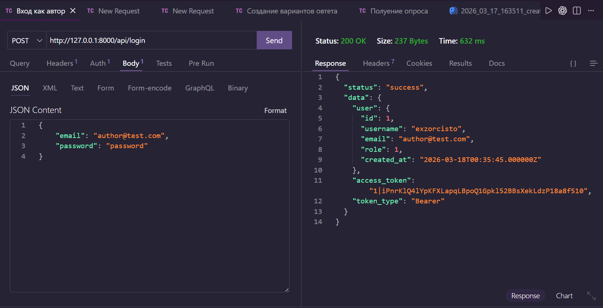
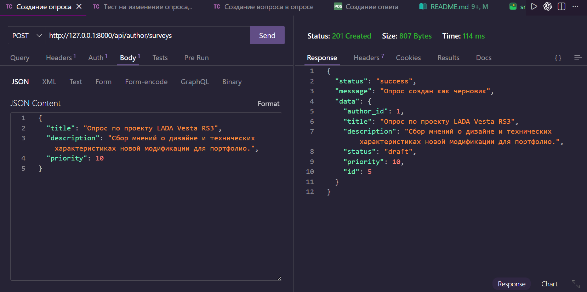
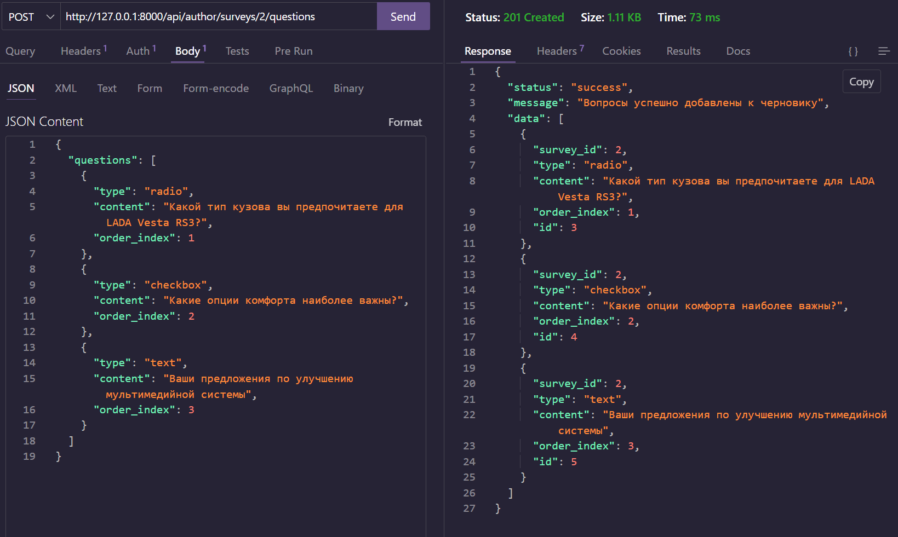
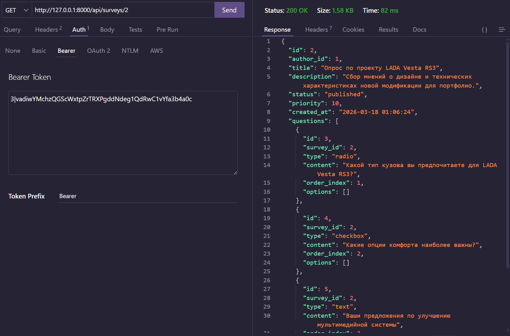
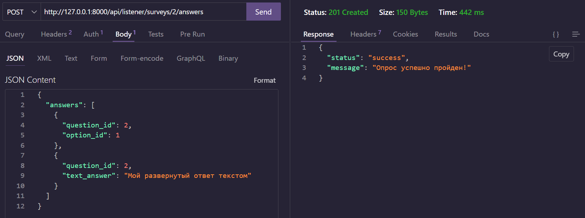
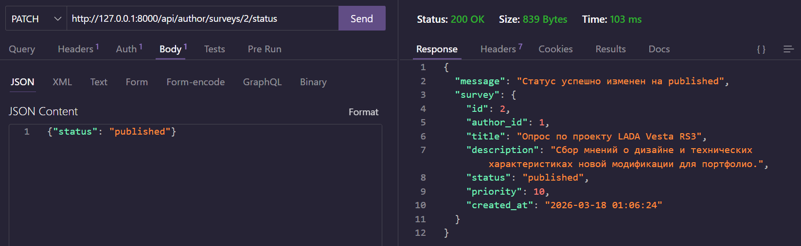
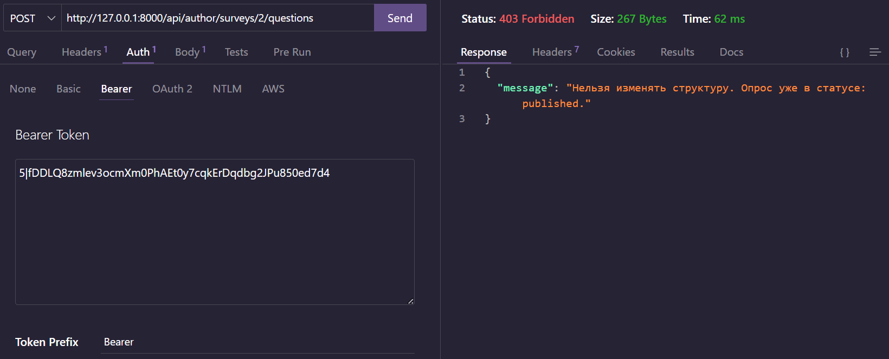
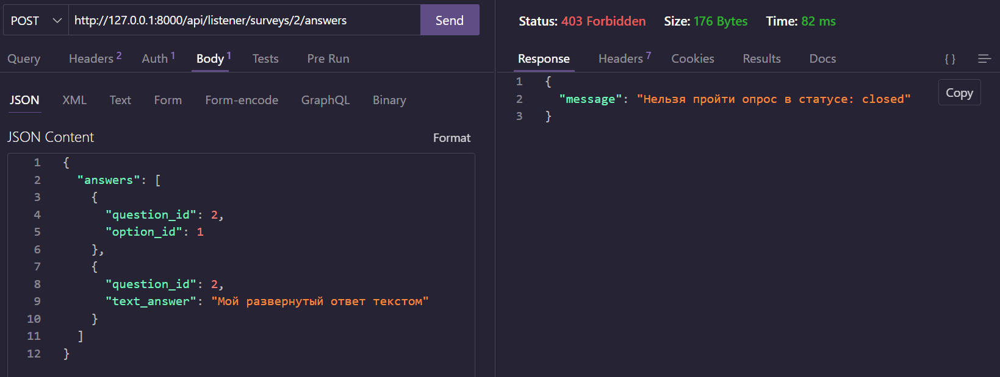

# REST API для системы опросов (Survey API)

Проект представляет собой серверную часть (API) для создания, управления и прохождения опросов. Система поддерживает разделение ролей (Авторы и Слушатели), защищена авторизацией по токенам и строго контролирует жизненный цикл опроса (Черновик -> Опубликован -> Закрыт).

## Технологический стек
* **Язык:** PHP 8.4
* **Фреймворк:** Laravel 12
* **База данных:** MySQL
* **Авторизация:** Laravel Sanctum (Токены)
* **Тестирование API:** Thunder Client

---

## ER-Диаграмма БД

> **Схема базы данных:**
> Отражает связи между пользователями, опросами, вопросами, вариантами ответов и результатами прохождения.


---

## Прогресс по чекпоинтам

### Чекпоинт 1: Проектирование и старт
- [x] Выбран стек технологий.
- [x] Инициализирован проект и Git-репозиторий.
- [x] Спроектирована ER-диаграмма базы данных.
- [x] Спроектирован список эндпоинтов API.
- [x] Созданы и успешно запускаются миграции (`php artisan migrate`).

**Список эндпоинтов API:**
# Документация API Эндпоинтов

## 1. Публичные маршруты (Аутентификация)
| Метод | Эндпоинт | Контроллер | Описание |
| :--- | :--- | :--- | :--- |
| `POST` | `/api/register` | `AuthController@register` | Регистрация нового пользователя |
| `POST` | `/api/login` | `AuthController@login` | Вход и получение токена доступа |

## 2. Общие защищенные маршруты
*Требуется заголовок `Authorization: Bearer {token}`*

| Метод | Эндпоинт | Контроллер | Описание |
| :--- | :--- | :--- | :--- |
| `GET` | `/api/surveys` | `SurveyController@index` | Список всех опросов (с сортировкой) |
| `GET` | `/api/surveys/{id}` | `SurveyController@show` | Детальная информация об опросе |
| `POST` | `/api/logout` | `AuthController@logout` | Выход из системы (отзыв токена) |

## 3. Зона АВТОРА (Role 1)
*Управление контентом и структурой*

| Метод | Эндпоинт | Контроллер | Описание |
| :--- | :--- | :--- | :--- |
| `POST` | `/api/author/surveys` | `SurveyController@store` | Создать новый опрос (черновик) |
| `PUT` | `/api/author/surveys/{id}` | `SurveyController@update` | Обновить данные опроса |
| `PATCH` | `/api/author/surveys/{id}/status` | `SurveyController@updateStatus` | Опубликовать или закрыть опрос |
| `POST` | `/api/author/surveys/{id}/questions` | `QuestionController@store` | Добавить вопрос (только в `draft`) |
| `POST` | `/api/author/questions/{id}/options` | `OptionController@store` | Добавить варианты ответов |

## 4. Зона СЛУШАТЕЛЯ (Role 2)
*Прохождение опросов*

| Метод | Эндпоинт | Контроллер | Описание |
| :--- | :--- | :--- | :--- |
| `GET` | `/api/listener/surveys/{id}/take` | `SurveyController@getForPassing` | Получить структуру активного опроса |
| `POST` | `/api/listener/surveys/{id}/answers` | `AnswerController@store` | Отправить ответы на опрос |

### Чекпоинт 2: Авторизация и создание опросов
- [x] Реализована регистрация и авторизация (Laravel Sanctum).
- [x] CRUD опросов (заголовок, описание, статус, приоритет).
- [x] Добавление вопросов к опросу (с указанием типа и порядка).
- [x] Добавление вариантов ответов к вопросам с выбором.
- [x] Валидация типов вопросов.
- [x] Подготовлены сидеры с тестовыми опросами (`php artisan db:seed`).

**Демонстрация работы API:**

1. **Успешная авторизация (получение Bearer Token):**


2. **Создание опроса (Статус: Draft):**


3. **Добавление вопроса и получение структуры опроса:**


---

### Чекпоинт 3: Жизненный цикл и прохождение
- [x] Реализована смена статусов: `draft` → `published` → `closed`.
- [x] Запрещено редактирование текста и структуры опубликованного опроса.
- [x] Реализовано получение опроса для прохождения (только `published`).
- [x] Отправка ответов респондентом с сохранением в БД.
- [x] Защита от повторного прохождения (выдается ошибка 403).

**Демонстрация защиты и бизнес-логики:**

1. **Слушатель получает доступ к опубликованному опросу:**


1. **Успешное прохождение опроса:**


1. **Защита от накрутки (Повторное прохождение):**


1. **Смена статуса опроса:**


1. **Защита от изменения опубликованного опроса (Блокировка автора):**


1. **Блокировка закрытых/черновых опросов для слушателя:**


---

## Установка и запуск (для проверки)

1. Клонировать репозиторий:

   ```Terminal
   git clone <твой_ссылка_на_репозиторий>
   ```

2. Установить зависимости:

   ```Terminal
   composer install
   ```

3. Скопировать файл .env.example в .env и настроить подключение к БД.
4. Сгенерировать ключ приложения:

    ```Terminal
    php artisan key:generate
    ```

5. Запустить миграции и сидеры:

   ```Terminal
   php artisan migrate --seed
   ```

6. Запустить локальный сервер:

   ```Terminal
   php artisan serve
   ```
